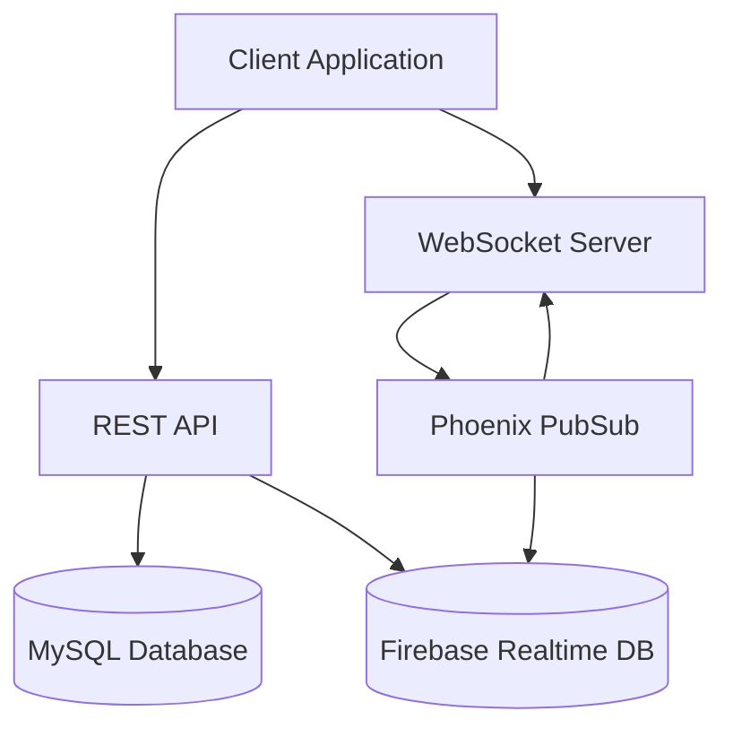
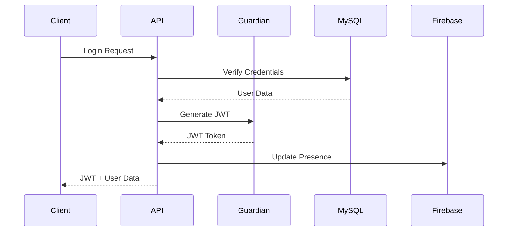
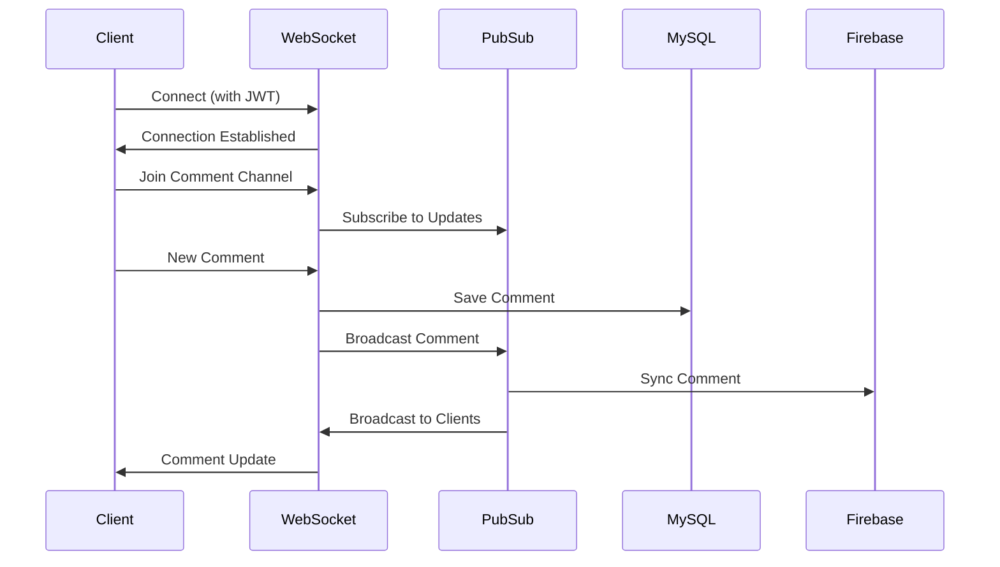
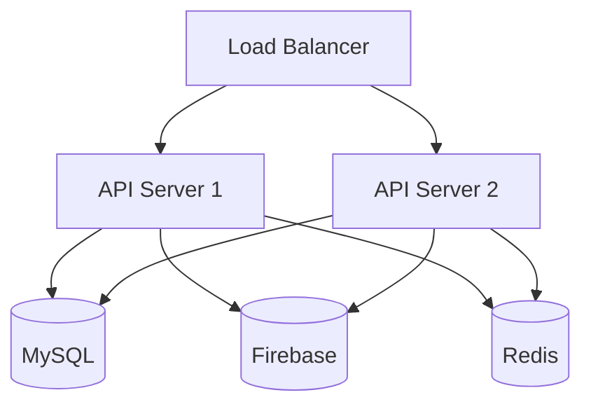

# Architecture Guide

## System Overview

Our system implements a hybrid architecture combining traditional REST APIs with real-time WebSocket connections, utilizing both MySQL and Firebase for different aspects of the application.



## Core Components

### 1. API Layer

The REST API handles:

- User authentication and authorization
- CRUD operations for comments
- User management
- Device management

Key modules:

- `AuthController`: Handles user authentication
- `CommentController`: Manages comment operations
- `Guardian`: JWT token management

### 2. Real-time Layer

WebSocket connections manage:

- Real-time comment updates
- Presence tracking
- Live synchronization with Firebase

Key modules:

- `UserSocket`: WebSocket connection management
- `CommentChannel`: Real-time comment broadcasting
- `Presence`: User presence tracking

### 3. Database Layer

#### MySQL (Primary Database)

Stores:

- User accounts
- Comments
- Device information
- Authentication data

Schema overview:

```sql
users
  - id (uuid)
  - email (string)
  - username (string)
  - password_hash (string)
  - last_login_at (timestamp)
  - is_active (boolean)

comments
  - id (uuid)
  - content (text)
  - video_id (string)
  - user_id (uuid, fk)
  - inserted_at (timestamp)
  - updated_at (timestamp)

user_devices
  - id (uuid)
  - user_id (uuid, fk)
  - device_id (string)
  - last_seen_at (timestamp)
  - device_info (jsonb)
  - is_active (boolean)
```

#### Firebase (Real-time Database)

Stores:

- Real-time comment data
- User presence information

### 4. PubSub System

Phoenix PubSub handles:

- Broadcasting comments to connected clients
- Synchronizing presence information
- Coordinating between multiple server nodes

## Authentication Flow



## Real-time Communication Flow



## Security Architecture

### Authentication

- JWT-based authentication using Guardian
- Token refresh mechanism
- Device-based authentication
- Rate limiting per user/device

### Authorization

- Role-based access control
- Resource-level permissions
- Channel-level authorization

### Data Protection

- Encrypted connections (SSL/TLS)
- Hashed passwords (Argon2)
- Input validation and sanitization
- SQL injection prevention

## Scalability

### Horizontal Scaling

- Stateless API servers
- Distributed PubSub
- Connection pooling
- Load balancing

### Performance Optimizations

- Database indexing
- Query optimization
- Caching strategies
- Background job processing

## Monitoring and Observability

### Metrics Collection

- Request latency
- WebSocket connections
- Database performance
- Firebase sync latency

### Logging

- Structured logging
- Error tracking
- Audit logging
- Performance logging

## Error Handling

### Types of Errors

1. Application Errors

   - Invalid input
   - Authorization failures
   - Resource not found

2. System Errors
   - Database connection issues
   - Firebase sync failures
   - Network timeouts

### Error Recovery

- Automatic retries
- Circuit breakers
- Fallback mechanisms
- Data reconciliation

## Development Considerations

### Code Organization

```
lib/
├── realtime_server/
│   ├── accounts/       # User management
│   ├── comments/       # Comment context
│   ├── firebase/       # Firebase integration
│   └── presence/       # Presence tracking
├── realtime_server_web/
│   ├── channels/       # WebSocket channels
│   ├── controllers/    # REST controllers
│   └── views/          # JSON views
```

### Testing Strategy

- Unit tests
- Integration tests
- Channel tests
- Load tests

### Deployment Architecture


